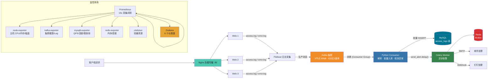

# ObsCraft — 基于 Kafka 的分布式日志收集与实时可观测性平台

> 企业级日志收集链路 + 异步告警 + 全维度监控，18 个容器一键编排。

---

## 目录

- [项目简介](#项目简介)
- [系统架构](#系统架构)
- [技术栈](#技术栈)
- [项目结构](#项目结构)
- [快速部署](#快速部署)
- [监控展示](#监控展示)
- [告警展示](#告警展示)
- [核心设计](#核心设计)
- [完整文档](#完整文档)

---

## 项目简介

Nginx 三台 Web 服务器产生访问日志 → Filebeat 采集并生产到 Kafka 集群 → Python 消费者解析清洗、批量入库 MySQL → 检测到 4xx/5xx 错误时通过 Celery 异步触发邮件 + 钉钉双通道告警。同时 Prometheus 采集 6 个维度的指标，Grafana 预置 6 个仪表盘实现全链路可观测。

---

## 系统架构



---

## 技术栈

| 组件 | 技术 | 用途 |
|------|------|------|
| 负载均衡 | Nginx 1.25 | 3 台 Web 服务器轮询分发 |
| 日志采集 | Filebeat 8.13 | 采集 Nginx 日志，生产到 Kafka |
| 消息队列 | Kafka (KRaft) | 3 节点集群，6 分区 3 副本，高可用缓冲 |
| 消费者 | Python 3.9 | 日志解析、批量入库、异常检测 |
| 数据库 | MySQL 8.0 | 日志持久化，索引优化 |
| 异步告警 | Celery + Redis | 4xx/5xx 实时告警，邮件 + 钉钉双通道 |
| 指标采集 | Prometheus | 6 个 exporter 目标，15s 采集 |
| 可视化 | Grafana 10.4 | 6 个预置仪表盘 |
| 编排 | Docker Compose | 18 个容器一键管理 |

---

## 项目结构

```
kafka-log-platform/
├── docker-compose.yml          # 核心编排 (18 容器)
├── app/                         # Python 应用
│   ├── Dockerfile              #   Consumer + Celery 共用镜像
│   ├── consumer.py             #   Kafka 消费：解析→入库→触发告警
│   ├── tasks.py                #   Celery 任务：邮件+钉钉双通道告警
│   ├── celery_app.py           #   Celery 实例 (Redis broker)
│   └── requirements.txt        #   Python 依赖
├── config/                      # 配置文件
│   ├── nginx/                  #   负载均衡 + Web 配置
│   ├── filebeat/filebeat.yml   #   日志采集 → Kafka 输出
│   ├── mysql/init.sql          #   建库建表 + 监控用户
│   ├── prometheus/prometheus.yml  # 6 个监控目标
│   └── grafana/                #   数据源 + 6 个仪表盘 JSON
└── docs/                        # 项目文档
    └── kafka-log-platform-doc.html
```

---

## 快速部署

```bash
git clone https://github.com/322dfs/ObsCraft.git
cd ObsCraft
docker compose up -d
```

### 访问地址

| 服务 | 地址 | 说明 |
|------|------|------|
| Web 应用 | `http://localhost:80` | Nginx → 3 台 Web |
| Grafana | `http://localhost:3000` | 6 个仪表盘 (admin/admin) |
| Prometheus | `http://localhost:9090` | 指标查询 |
| cAdvisor | `http://localhost:8080` | 容器监控 |

---

## 监控展示

> 截图待补充 — 以下是 6 个 Grafana 仪表盘的实际效果。

### 主机概览

<!-- 截图占位：host-overview 仪表盘 -->


### Kafka 集群监控

<!-- 截图占位：kafka-monitor 仪表盘 -->


### MySQL 监控

<!-- 截图占位：mysql-monitor 仪表盘 -->


### Redis 监控

<!-- 截图占位：redis-monitor 仪表盘 -->


### 容器资源概览

<!-- 截图占位：container-overview 仪表盘 -->


### 应用层综合概览

<!-- 截图占位：app-overview 仪表盘 -->


---

## 告警展示

> 截图待补充 — 当 Consumer 检测到 4xx/5xx 状态码时，Celery 异步触发双通道告警。

### 邮件告警

<!-- 截图占位：邮件告警截图 -->


### 钉钉告警

<!-- 截图占位：钉钉告警截图 -->


---

## 核心设计

### Kafka 集群 — KRaft 模式

- **3 节点 KRaft**：无需 ZooKeeper，降低运维复杂度
- **6 分区 3 副本**：高并发写入 + 容错，单节点故障不丢数据
- **手动提交 offset**：`enable_auto_commit=False`，保证至少一次消费语义

### 日志处理链路

1. **Filebeat** 挂载 3 台 Web 日志目录，round-robin 生产到 Kafka 6 分区
2. **Consumer** 拉取消息 → JSON 解析 → Nginx 正则提取 → 批量入库（BATCH_SIZE=100）
3. **告警** 检测 4xx/5xx → `send_alert.delay()` → Celery 异步 → 邮件 + 钉钉

### 监控体系

| Exporter | 监控对象 | 关键指标 |
|----------|----------|----------|
| node-exporter | 主机系统 | CPU、内存、磁盘、网络 |
| kafka-exporter | Kafka 集群 | 消息速率、Lag、分区健康 |
| mysqld-exporter | MySQL | QPS、连接数、慢查询 |
| redis-exporter | Redis | 内存、连接、命令统计 |
| cAdvisor | 所有容器 | 容器 CPU/内存/IO |
| Prometheus | 自身 | 采集延迟、规则评估 |

---

## 完整文档

包含架构详解、部署步骤、踩坑记录、量化数据等：

[项目完整文档](docs/kafka-log-platform-doc.html)

---

## License

MIT