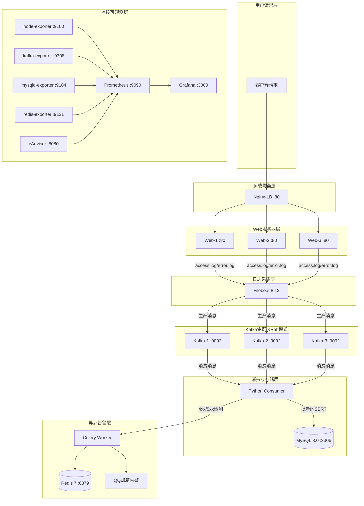
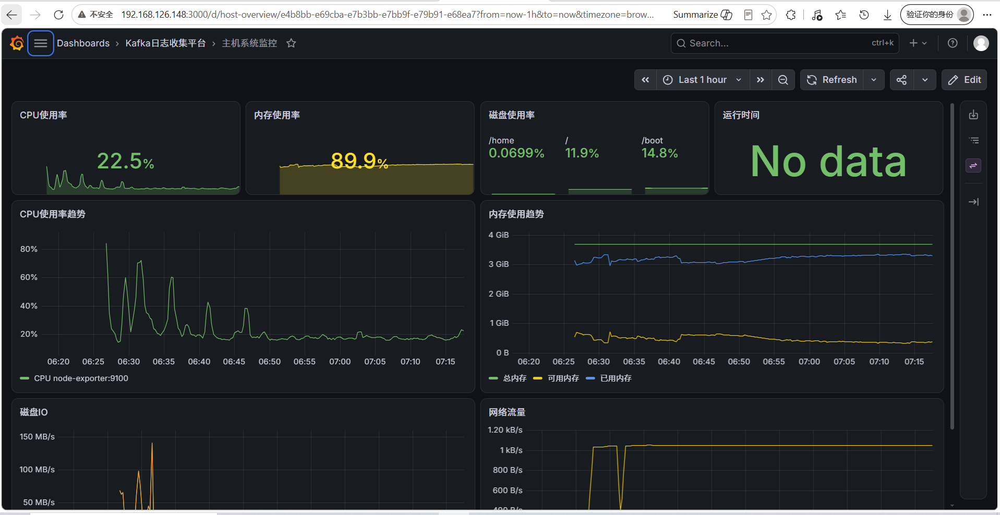
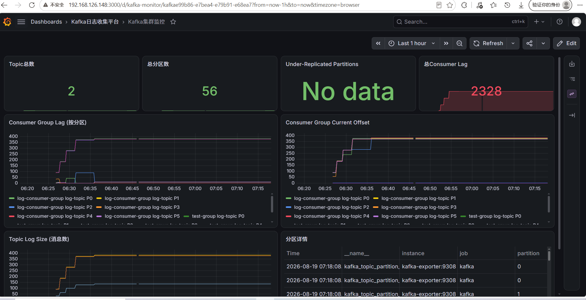
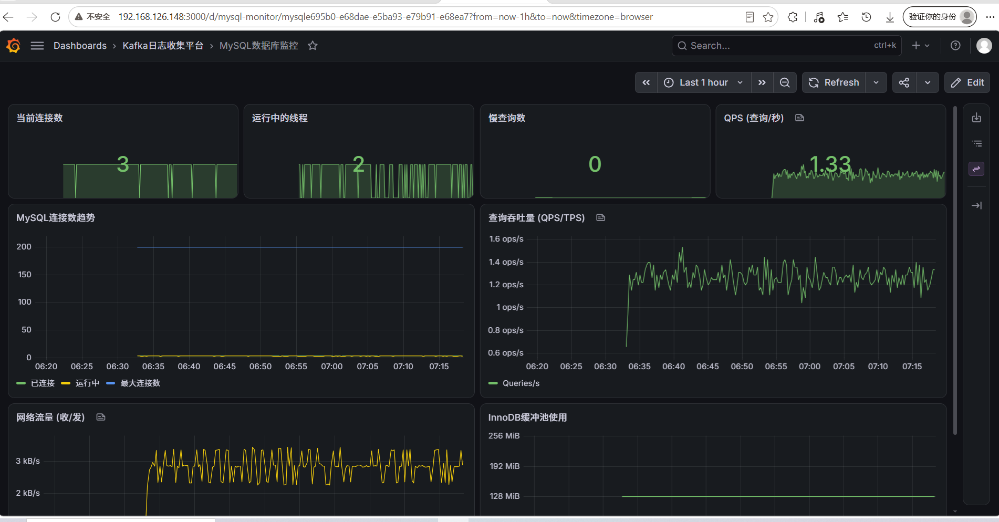
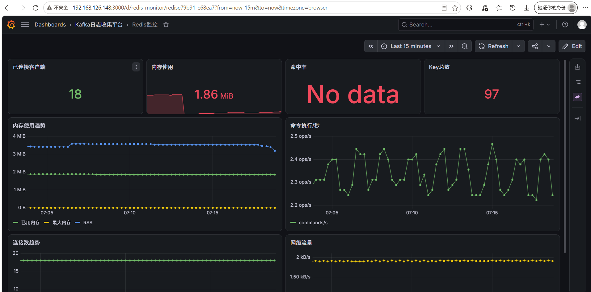
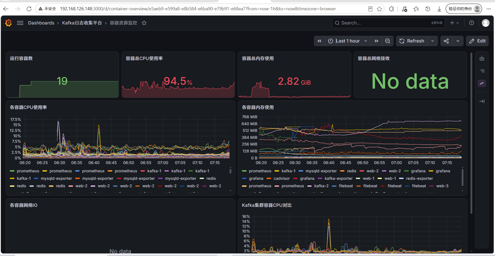
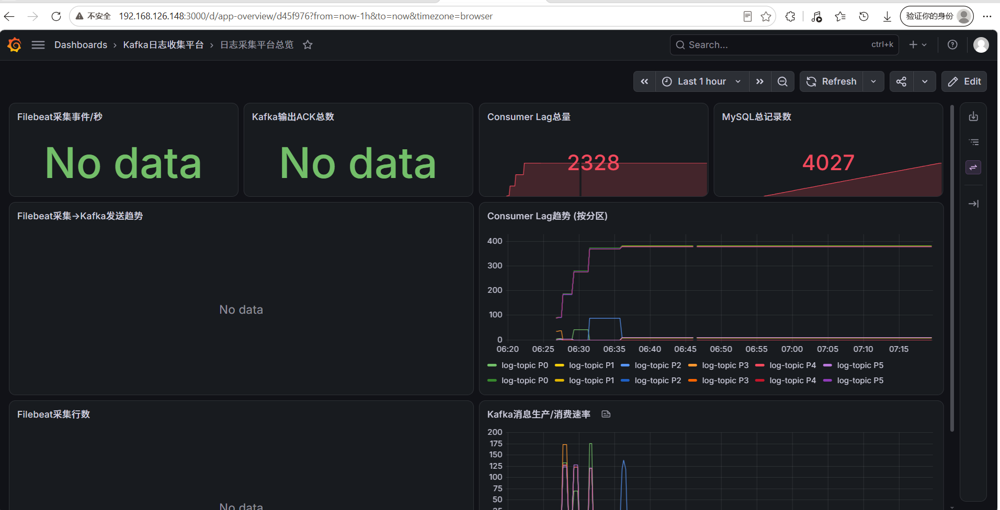

# ObsCraft — 基于 Kafka 的分布式日志收集与实时可观测性平台

> Nginx 负载均衡模拟 3 台 Web 服务器 → Filebeat 采集日志到 Kafka 集群 → Python 消费者解析入库 → Celery 异步告警 → Prometheus + Grafana 全链路监控。18 个容器一键编排。

| 容器数 | Kafka 分区 | Kafka 副本 | Grafana 仪表盘 | 采集目标 | 批量入库 |
|:------:|:----------:|:----------:|:--------------:|:--------:|:--------:|
| 18 | 6 | 3 | 6 | 6 | 100 条/批 |

---

## 目录

- [项目背景](#项目背景)
- [项目价值](#项目价值)
- [企业应用场景](#企业应用场景)
- [系统架构](#系统架构)
- [技术栈](#技术栈)
- [项目结构](#项目结构)
- [快速部署](#快速部署)
- [监控展示](#监控展示)
- [告警展示](#告警展示)
- [核心设计](#核心设计)
- [完整文档](#完整文档)

---

## 项目背景

在企业级微服务架构中，Web 服务器通常以多实例方式部署在高可用负载均衡器后端。每台服务器每天产生大量访问日志（access.log）和错误日志（error.log），这些日志分散在各个服务器节点上，存在以下痛点：

- **日志分散**：运维人员需要逐台 SSH 登录服务器查看日志，排查效率极低
- **无实时告警**：HTTP 5xx 错误和 4xx 异常无法在发生时立即通知到运维人员
- **无历史分析**：日志随时间轮转覆盖，无法对历史数据进行 SQL 查询和趋势分析
- **无统一监控**：各组件（Kafka、MySQL、Redis 等）的运行状态无统一视图

本项目通过引入 Kafka 作为日志消息中间件，将日志采集与日志消费解耦，实现日志的集中存储、实时分析和自动告警，同时通过 Prometheus + Grafana 构建完整的可观测性体系。

---

## 项目价值

### 技术价值

- **生产者-消费者解耦**：Filebeat 只负责采集生产到 Kafka，Consumer 按自己的节奏消费入库，互不阻塞。即使 MySQL 短暂宕机，日志消息也不会丢失（Kafka 持久化保留）
- **削峰填谷**：流量高峰时 Kafka 作为缓冲池，Consumer 按固定速率消费，避免数据库被瞬时写入压垮
- **KRaft 模式去 ZooKeeper**：使用 Kafka 的 KRaft 共识协议替代 ZooKeeper，减少运维组件，简化部署架构
- **异步告警**：通过 Celery + Redis 将告警发送异步化，Consumer 检测到错误后不阻塞消费流程

### 业务价值

- **实时可观测**：运维人员通过 Grafana 仪表盘即可了解全链路状态，无需逐节点排查
- **秒级告警**：HTTP 4xx/5xx 错误发生后 0.3~0.6 秒内收到邮件告警
- **数据可查**：日志入库 MySQL 后可通过 SQL 进行多维分析（按状态码、服务器、时间范围查询）
- **容量规划**：通过 Kafka Consumer Lag 指标可判断是否需要扩容消费者

---

## 企业应用场景

### 场景一：电商大促日志监控

双十一等大促期间，Web 服务器 QPS 飙升 10~100 倍，日志量暴增。Kafka 集群作为缓冲池存储海量日志消息，Consumer 按数据库写入能力匀速消费，避免数据库被压垮。运维通过 Grafana 监控 Consumer Lag，当 Lag 持续增长时动态扩容消费者实例。

### 场景二：安全审计与合规

金融行业要求所有访问日志保留至少 6 个月。日志通过 Kafka 持久化后入库 MySQL，可按 IP、时间、URL 进行安全审计查询，识别异常访问模式（如短时间内大量 404 请求可能为恶意扫描）。

### 场景三：微服务链路追踪

在微服务架构中，Nginx 作为 API 网关记录所有入站请求。通过 Filebeat 采集后统一存入 Kafka，可用于后续的链路追踪分析，将 Nginx 访问日志与应用服务日志关联，实现端到端请求追踪。

### 场景四：SLA 监控与告警

当 Web 服务出现 5xx 错误时，Celery Worker 自动发送邮件 + 钉钉双通道告警，运维团队可在用户投诉前感知并处理故障。Grafana 仪表盘展示错误率趋势，用于 SLA 达成率计算。

---

## 系统架构



---

## 技术栈

| 组件 | 技术 | 用途 |
|------|------|------|
| 负载均衡 | Nginx 1.25 | 3 台 Web 服务器轮询分发 |
| 日志采集 | Filebeat 8.13 | 采集 Nginx 日志，生产到 Kafka |
| 消息队列 | Kafka (KRaft) | 3 节点集群，6 分区 3 副本，高可用缓冲 |
| 消费者 | Python 3.9 | 日志解析、批量入库、异常检测 |
| 数据库 | MySQL 8.0 | 日志持久化，索引优化 |
| 异步告警 | Celery + Redis | 4xx/5xx 实时告警，邮件 + 钉钉双通道 |
| 指标采集 | Prometheus | 6 个 exporter 目标，15s 采集 |
| 可视化 | Grafana 10.4 | 6 个预置仪表盘 |
| 编排 | Docker Compose | 18 个容器一键管理 |

---

## 项目结构

```
kafka-log-platform/
├── docker-compose.yml          # 核心编排 (18 容器)
├── app/                         # Python 应用
│   ├── Dockerfile              #   Consumer + Celery 共用镜像
│   ├── consumer.py             #   Kafka 消费：解析→入库→触发告警
│   ├── tasks.py                #   Celery 任务：邮件+钉钉双通道告警
│   ├── celery_app.py           #   Celery 实例 (Redis broker)
│   └── requirements.txt        #   Python 依赖
├── config/                      # 配置文件
│   ├── nginx/                  #   负载均衡 + Web 配置
│   ├── filebeat/filebeat.yml   #   日志采集 → Kafka 输出
│   ├── mysql/init.sql          #   建库建表 + 监控用户
│   ├── prometheus/prometheus.yml  # 6 个监控目标
│   └── grafana/                #   数据源 + 6 个仪表盘 JSON
└── docs/                        # 项目文档
    └── kafka-log-platform-doc.html
```

---

## 快速部署

```bash
git clone https://github.com/322dfs/ObsCraft.git
cd ObsCraft
docker compose up -d
```

### 访问地址

| 服务 | 地址 | 说明 |
|------|------|------|
| Web 应用 | `http://localhost:80` | Nginx → 3 台 Web |
| Grafana | `http://localhost:3000` | 6 个仪表盘 (admin/admin) |
| Prometheus | `http://localhost:9090` | 指标查询 |
| cAdvisor | `http://localhost:8080` | 容器监控 |

---

## 监控展示

### 主机概览



### Kafka 集群监控



### MySQL 监控



### Redis 监控



### 容器资源概览



### 应用层综合概览



---

## 告警展示

> 截图待补充 — 当 Consumer 检测到 4xx/5xx 状态码时，Celery 异步触发双通道告警。

---

## 核心设计

### Kafka 集群 — KRaft 模式

- **3 节点 KRaft**：无需 ZooKeeper，降低运维复杂度
- **6 分区 3 副本**：高并发写入 + 容错，单节点故障不丢数据
- **手动提交 offset**：`enable_auto_commit=False`，保证至少一次消费语义

### 日志处理链路

1. **Filebeat** 挂载 3 台 Web 日志目录，round-robin 生产到 Kafka 6 分区
2. **Consumer** 拉取消息 → JSON 解析 → Nginx 正则提取 → 批量入库（BATCH_SIZE=100）
3. **告警** 检测 4xx/5xx → `send_alert.delay()` → Celery 异步 → 邮件 + 钉钉

### 监控体系

| Exporter | 监控对象 | 关键指标 |
|----------|----------|----------|
| node-exporter | 主机系统 | CPU、内存、磁盘、网络 |
| kafka-exporter | Kafka 集群 | 消息速率、Lag、分区健康 |
| mysqld-exporter | MySQL | QPS、连接数、慢查询 |
| redis-exporter | Redis | 内存、连接、命令统计 |
| cAdvisor | 所有容器 | 容器 CPU/内存/IO |
| Prometheus | 自身 | 采集延迟、规则评估 |

---

## 完整文档

包含架构详解、部署步骤、踩坑记录、量化数据等：

[项目完整文档](docs/kafka-log-platform-doc.html)

---

## License

MIT
